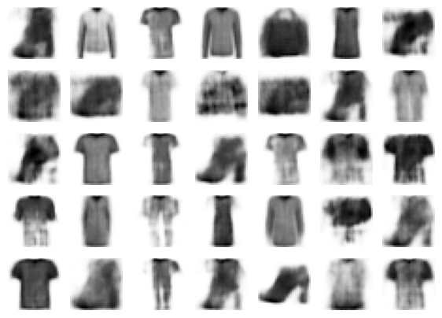

# Computer Vision Image Generation Project

This project contains implementations of DDPM (Denoising Diffusion Probabilistic Models) and VAE (Variational Autoencoder) for generative modeling, along with quantitative  and qualitative analysis.

## Project Report
For a detailed report of this project, please view: [GenCV003_Report.pdf](GenCV003_Report.pdf)

## Repo Files Structure

### DDPM/
Contains DDPM (Denoising Diffusion Probabilistic Model) implementations:

1. **[DDPM/DDPM_Fashion_Mnist.ipynb](DDPM/DDPM_Fashion_Mnist.ipynb)** - Standard DDPM implementation
2. **[DDPM/Conditional_DDPM_Fashion_Mnist.ipynb](DDPM/Conditional_DDPM_Fashion_Mnist.ipynb)** - Conditional DDPM implementation

### VAE/
Contains VAE (Variational Autoencoder) implementations:

1. **[VAE/VAE_Fashion_Mnist.ipynb](VAE/VAE_Fashion_Mnist.ipynb)** - VAE implementation

### Running_Models/
Contains notebooks for running pre-trained models:

1. **[Running_Models/DDPM_Running.ipynb](Running_Models/DDPM_Running.ipynb)** - Run pre-trained DDPM model
2. **[Running_Models/VAE_Running.ipynb](Running_Models/VAE_Running.ipynb)** - Run pre-trained VAE model

### Quantitative_Analysis/
Contains quantitative analysis, model variants optimized for analysis, and generated data:

#### Main Analysis Notebook
- **[Quantitative_Analysis/Quantitaive_Analysis.ipynb](Quantitative_Analysis/Quantitaive_Analysis.ipynb)** - Main quantitative analysis notebook that compares and evaluates DDPM and VAE generated data using various metrics.

#### Model_variants_for_QA (Model Variants for Quantitative Analysis)
This subfolder contains optimized model variants specifically designed for quantitative analysis with reduced computation time:

1. **[Quantitative_Analysis/Model_variants_for_QA/DDPM_T1000_for_QA.ipynb](Quantitative_Analysis/Model_variants_for_QA/DDPM_T1000_for_QA.ipynb)** - DDPM with 1000 timesteps (vs 4000 in standard implementation) for accelerated image generation during metrics computation.

2. **[Quantitative_Analysis/Model_variants_for_QA/VAE_for_QA.ipynb](Quantitative_Analysis/Model_variants_for_QA/VAE_for_QA.ipynb)** - VAE variant used for image generation during the quantitative analysis phase.

#### Generated Data
The **[Quantitative_Analysis/generated_data/](Quantitative_Analysis/generated_data/)** folder contains pre-generated `.npy` files:
- Generated samples from DDPM model
- Generated samples from VAE model

### Saved_Models/
The `Saved_Models/` folder contains pre-trained model weights organized by model type:

#### DDPM/
Contains pre-trained DDPM model files:
- **[Saved_Models/DDPM/diffusion_4000.keras](Saved_Models/DDPM/diffusion_4000.keras)** - Standard DDPM implementation trained with 4000 timesteps.
- **[Saved_Models/DDPM/diffusion_1000.keras](Saved_Models/DDPM/diffusion_1000.keras)** - DDPM variant trained with 1000 timesteps, used during the quantitative analysis phase for faster computation.

#### VAE/
Contains pre-trained VAE decoder weights:
- **[Saved_Models/Vae/variational_decoder_weights.h5](Saved_Models/Vae/variational_decoder_weights.h5)** - VAE decoder weights used for image generation.

## How to Run the 2 Models

### DDPM Model
To run the pre-trained DDPM model and generate images:

1. Open the notebook: **[Running_Models/DDPM_Running.ipynb](Running_Models/DDPM_Running.ipynb)**
2. Execute all cells from top to bottom

### VAE Model
To run the pre-trained VAE model and generate images:

1. Open the notebook: **[Running_Models/VAE_Running.ipynb](Running_Models/VAE_Running.ipynb)**
2. Execute all cells from top to bottom

## Generated Examples from DDPM & VAE

### DDPM Generated Images

### VAE Generated Images

